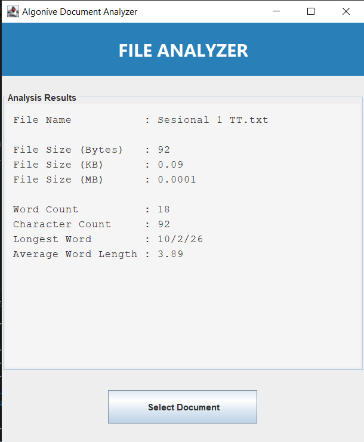

# 📄 Document Analyzer 

Premium Java Swing Desktop Application built for Internship at Algonive.

## 🚀 Features

- File Size Calculation (Bytes, KB, MB)
- Word Count
- Character Count
- Longest Word Detection
- Average Word Length Calculation
- Dark Modern UI
- File Type Validation (.txt)
- Reset Button
- Status Bar

## 🛠 Technologies Used

- Java
- Java Swing
- File Handling (java.io, java.nio)
- Object-Oriented Programming

## ▶ How to Run

1. Compile:
   javac FileSizeCalculator.java

2. Run:
   java FileSizeCalculator

## 🎯 Internship Project

This project was developed as part of the Algonive Internship Program to demonstrate practical Java programming and GUI development skills.

## 📸 Application Preview

